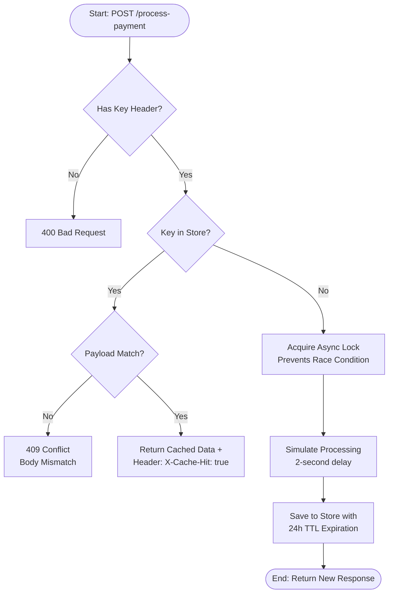

# FinSafe Idempotency Gateway (The "Pay-Once" Protocol)

This repository contains a high-reliability Idempotency Layer designed for  FinSafe Transactions Ltd. to prevent duplicate charges caused by network timeouts and client-side retries.

## System Architecture
The following logic flow illustrates how the gateway handles incoming requests, manages state, and prevents race conditions using an asynchronous locking mechanism.



**Key Features & Acceptance Criteria**
Happy Path Logic: Successfully processes new payments with a simulated 2-second banking delay.

Strict Idempotency: Legitimate retries with the same Idempotency-Key receive the original cached response instantly without re-processing.

X-Cache-Hit Header: Replayed responses include a custom header to inform the client the result was served from the cache.

Integrity Protection: Blocks attempts to reuse a key for a different payment amount or currency (HTTP 409 Conflict).

Concurrency Control: Handles the "In-Flight" challenge using asyncio.Lock, ensuring simultaneous identical requests are queued rather than duplicated.

**Technical Design Decisions**
FastAPI: I chose FastAPI for its native support for asynchronous programming. In a Fintech gateway, non-blocking I/O is critical to maintaining low latency while waiting for external banking confirmations.

In-Memory Storage: To prioritize performance and minimize database overhead for this prototype, I implemented a dictionary-based storage engine.

Thread Safety: To meet the Bonus User Story requirements, I implemented an asynchronous lock. This prevents "Race Conditions" where two identical requests hitting the server at the exact same millisecond might bypass the cache check.

**Developer's Choice: TTL Memory Management**

In a production environment, storing idempotency keys indefinitely would eventually exhaust server memory.

The Feature: I implemented an automatic expiration (TTL) mechanism. Every saved transaction is timestamped, and the storage layer automatically prunes/deletes keys older than 24 hours. This ensures the system remains scalable, memory-efficient, and respects data privacy by not holding transaction hashes longer than necessary.

Setup and Usage
Prerequisites
Python 3.8+

Installation
Clone the repository:
```
Bash

git clone https://github.com/ivo-n-g/AmaliTech-DEG-Project-based-challenges
cd  AmaliTech-DEG-Project-based-challenges/backend/Idempotency-gateway
Set up a Virtual Environment:  python -m venv venv
# On Linux use: source venv/bin/activate  
# On Windows use: venv\Scripts\activate
```
Install Dependencies:
```
pip install -r requirements.txt
```
### Running the API
```
Start the server using Uvicorn:
uvicorn main:app --reload
The API will be available at: http://127.0.0.1:8000/docs
```
### API Documentation
Endpoint: POST /process-payment

Required Header: Idempotency-Key: <unique_string>

Sample Body:

JSON
{
  "amount": 100,
  "currency": "GHS"
}
Interactive Docs: Visit http://127.0.0.1:8000/docs to test the API directly from your browser.
